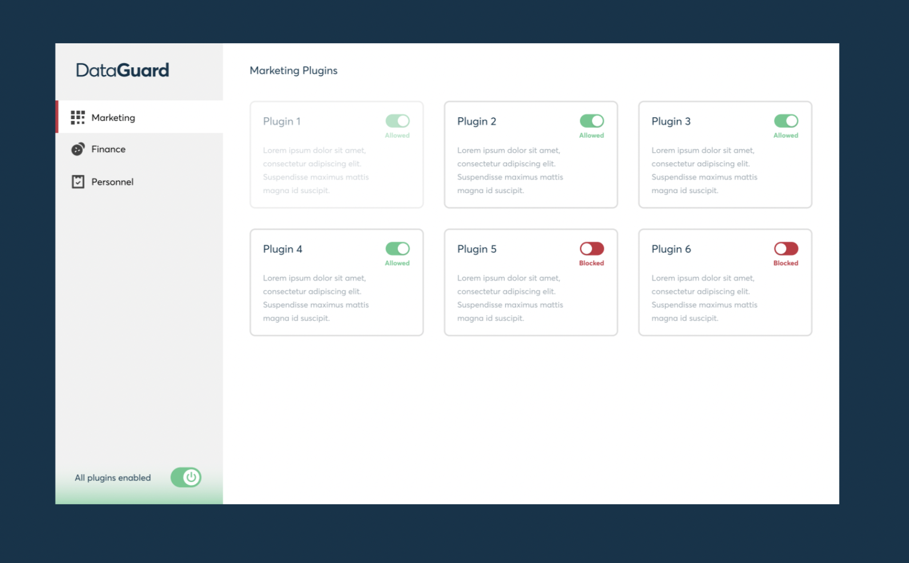

# DataGuard Assessment Test

## Content
- [Problem Definition](#TASK)
- [Solution](#solution)
  - [Problem Assumptions](#assumptions)
  - [Json-Server](#json-server)

### TASK 
- Create User Interface as per the Design on next slides 
- Create a mock JSON API server for handling GET and POST requests - Retrieve data from that mock server, use it in your components.  
- Make sure the Toggle Switches are working with the API. 
- Ensure the overall Power Switch disables all the plugins in all the tabs as per the Design. - Switching between Tabs, should change the URL

### DELIVERABLE 
- Deploy your submission on heroku/netlify and share the link. 
- Share a link to your code from github/bitbucket whichever works fine for you.

### DATA SOURCE 
[https://dataguard.blob.core.windows.net/challenges/plugins/fe-challenge.json](https://dataguard.blob.core.windows.net/challenges/plugins/fe-challenge.json)

### SAMPLE

# SOLUTION

### ASSUMPTIONS
To solve this challenge, I had to make some basic assumptions to guide the development as there was limited information into the intrincasies. Some of which include: 

- I assume I'm supposed to maintain the schema of the datasource in my server. 
- I assume the tabs list is not growing. That is there would be at most 3 tabs as exist in the given design i.e Marketing, Fincance, Personnel
- I assume the plugin for each tab are the default plugins in the given [datasource](https://dataguard.blob.core.windows.net/challenges/plugins/fe-challenge.json) active, inactive and disabled property. That is,
  - Marketing: plugin1, plugin2, plugin3, plugin4, plugin5, plugin6
  - Finance: plugin7, plugin8, plugin9, plugin10
  - Personnel: plugin11, plugin12, plugin13
- I assume the states represents:
  - Active State: When toggle is checked (Allowed).
  - Inactive State: when toggle is unchecked (Blocked).
  - Disabled State: when card is opaque and toggle button disabled (Disabled).
- I assume the overall Power switch when **active** moves **all plugins** in each tab to the **active state**.
- I assume the overall Power switch when **inactive** moves **all plugins** in each tab to the **inactive state**.
- I assume all POST and GET request to the server must maintain the given datasource schema.

### Json-Server
JSON-Server is hosted on [Glitch](https://glitch.com/edit/#!/stirring-glittery-kicker?path=README.md%3A1%3A0) so it can be accessed remotely when project is hosted on netlify / heroku.

The remote sever url is [https://stirring-glittery-kicker.glitch.me/data](https://stirring-glittery-kicker.glitch.me/data)